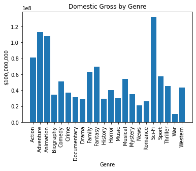
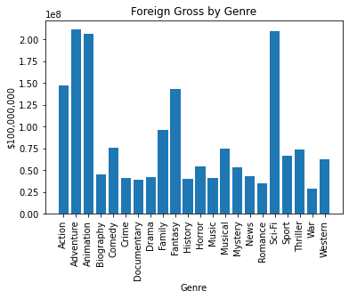
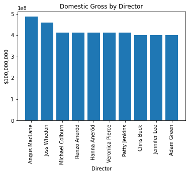

# How to make a banger movie?

## Overview
Given samples of data from IMDB and other movie websites, we need to take a look at the data, clean it up and turn it into analysis that means something. The data can be used to determine factors that produce a movie with the highest likely box office.

## Business Understanding
In this scenario, a new movie studio is approaching us and trying to figure out the parameters they need to produce in order to immediately enter the market with a certified banger. The parameters we are going to look at for this scenario are the runtime (in minutes), the genre and the director to hire for the movies production.

## Data Understanding and Analysis
All of the ensuing data analysis will have two categories involved:
* domestic gross
* foreign gross

**Movie Runtime:**

**Movie Genre:**

**Movie Director:**

## Conclusion
Using the data we can see from these 6 charts, we can come to some evident conclusions for each goal we set out to achieve. 

**Movie Runtime:**
* Producing a movie with a runtime between 100-175 minutes have the highest likelihood of producing a substantial revenue for both the domestic and foreign markets.

**Movie Genre:**
* Producing a movie with the Sci-Fi genre is a clear winner in both the domestic and foreign markets.
* However, we are presented with the opportunity of variety in the foreign market where if this is your target market you can produce an Adventure or Animation instead and still produce a substantial amount of revenue.

**Movie Director:**
* Although there is a clear winner for each market, and one for the combined markets we can safely say if you pick one of the top 10-15 directors you cannot go wrong. They all have produced quite a similar amount of revenue with little variation between them.
  * However, if you had to pick Joss Whedon would be the ideal director.